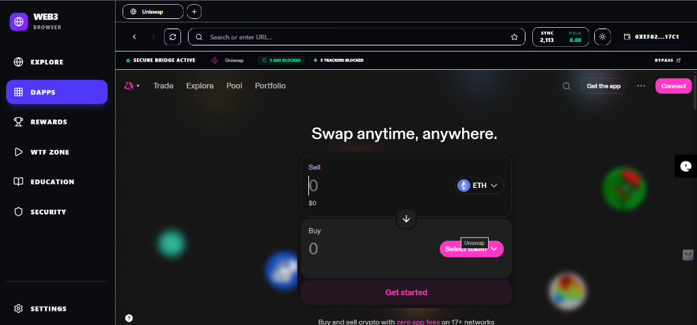
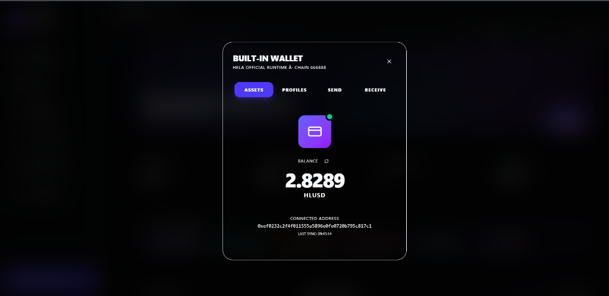

# 🌐 Web3 Browser Platform

An immersive, decentralized web browser and application gateway built for the next generation of the internet. This platform is designed to promote Web3 adoption for beginners through a gamified, secure, and intuitive experience while integrating powerful features like a built-in wallet and native ad-blocking.

## 🚀 The Vision: Promoting Web3 & Social Impact

Our browser aims to solve the steep learning curve associated with Web3. We've built an environment that is **not just a tool, but an educational gateway**.

### Unique Selling Propositions (USPs)
- **Gamified Onboarding**: Users earn points and cryptocurrency (Hela) by interacting with dApps, completing quests (like the "Scholar" or "Explorer" quests), and engaging with educational content.
- **Inbuilt Wallet Gateway**: No need for complicated third-party extensions right away; the browser acts as a secure 'Neural Sync' identity layer that seamlessly integrates with existing Web3 wallets.
- **Native Security & Adblocking**: An integrated "Neural Guard" actively scores and blocks ads/trackers, ensuring a safe browsing experience while protecting users from malicious Web3 actors.
- **Ecosystem Registry**: A curated grid of trusted decentralized applications (DeFi, NFTs, Bridges) to prevent beginners from falling victim to phishing sites.
- **Social Impact**: By rewarding users for learning about decentralized technologies and security best practices, we foster a more educated, technically empowered, and financially self-sovereign community.

---

## 📸 Screenshots

<div align="center">
  
  
  
  
</div>

---

## 🏗️ Project Structure
The frontend is built using **React** and **Vite**, structured for high performance and immersive UI/UX.

```
frontend/
├── src/
│   ├── components/      # Reusable UI components (Games, Modals, etc.)
│   ├── data/            # Local data structure (dApp registry)
│   ├── App.jsx          # Main application logic and routing state
│   ├── index.css        # Global styles (Tailwind + Custom themes)
│   └── main.jsx         # React DOM entry point
├── package.json         # Dependencies
└── tailwind.config.js   # Tailwind aesthetic configurations
```

---

## 🔗 Smart Contract Integration

The platform integrates directly with the **Hela Network**.

### Network Capabilities (Hela Testnet)
- **Network Name**: Hela Testnet
- **Chain ID**: `666888` (Hex: `0xa2d08`)
- **RPC URL**: `https://testnet-rpc.helachain.com`
- **Block Explorer**: `https://testnet-blockexplorer.helachain.com`
- **Native Currency**: HLUSD

### Deployed Contract Details
- **Token / Contract Address**: `0xBE75FDe9DeDe700635E3dDBe7e29b5db1A76C125`

**Proof of Transactions (Tx Hashes):**
1. `0x189b830b54a34d492d1ba594211f9bb7a54f853dda5cae343b89cb7acd9dc987`
2. `0x661e041ea358d82da5d8ea2fdf37f7bea92370fce6a6f7ae880244abee42b7c2`
3. `0xe80ffdf3b88357dd5490f63ac42a457be69b749168ddc742abd3baf96f51ed9e`

---

## ⚙️ How it Works Currently

1. **Identity Handshake**: Upon opening the browser, users are greeted with a "Wallet Gatekeeper" modal. They authenticate via their Web3 wallet (e.g., MetaMask). If the user is not on the Hela Testnet, the browser gracefully prompts them to add/switch networks.
2. **The Workspace**: Users gain access to a customized desktop-like interface with a sidebar containing sections for Explore, DApps, Rewards, WTF Zone (Games), Education, and Security.
3. **Immersive Browsing**: The explore section acts as a search engine and gateway. When a user opens a DApp, it loads seamlessly within the browser workspace using iframe neural link technology to maintain the immersive experience.
4. **Economic Engine**: As the user browses, reads educational articles, and completes actions, the frontend communicates with the centralized backend to record "Sync" points. These points can be redeemed in the Rewards tab for actual crypto assets (transferred via smart contract).

---

## 💻 Setup & Installation

To run the frontend locally:

1. **Clone the repository:**
   ```bash
   git clone https://github.com/Apoorv-sharma1/web3browser.git
   cd web3browser
   ```

2. **Install Dependencies:**
   ```bash
   npm install
   ```

3. **Configure Environment:**
   Create a `.env` file in the root directory:
   ```env
   VITE_API_URL=http://localhost:5000 # Or your deployed backend URL
   ```

4. **Start the Development Server:**
   ```bash
   npm run dev
   ```
   *The application will be available at http://localhost:5173/*
